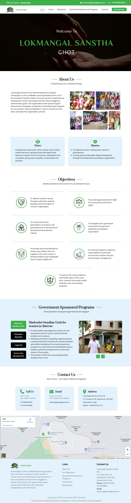

# Lokmangal


## Table of contents

- [Lokmangal](#lokmangal)
  - [Table of contents](#table-of-contents)
  - [Overview](#overview)
    - [Lokmangal Sansta Ghot](#lokmangal-sansta-ghot)
    - [Screenshots](#screenshots)
  - [Getting Started](#getting-started)
      - [Step 1: Clone or Download this repository](#step-1-clone-or-download-this-repository)
      - [Step 2: Install dependencies and run the project](#step-2-install-dependencies-and-run-the-project)
  - [Contributors](#contributors)


## Overview

### Lokmangal Sansta Ghot
Lokmangal is a non-profitable social organization born out of the concept of holistic health of women and the comprehensive development of the rural people and from their struggles to achieve these goals.

### Screenshots



## Getting Started<a id="gettingstarted"></a>

#### Step 1: Clone or Download this repository

Download or clone this repository by using the command given below:

```
git clone https://github.com/sd8capricon/Lokmangal.git
```

#### Step 2: Install dependencies and run the project

Go to project root and run the command below

```
npm install or yarn install
npm run dev
```


## Contributors
- Siddharth Dhaigude<br>
  [](https://www.linkedin.com/in/sdhaigude)
  [](https://github.com/sd8capricon)
- Leona Varghese<br>
  [](https://www.linkedin.com/in/leona-varghese-95897921b)
  [](https://github.com/LeonaWH)
- Alston Fernandes<br>
  [](https://www.linkedin.com/in/alston-fernandes-b28720220/)
  [](https://github.com/05Alston)